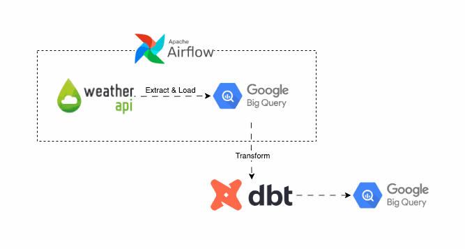

# City Weather Data Extraction and Analysis Pipeline

<br>

## Objectives
The aim of this project is to build a data pipeline to perform ETL/ELT by extracting weather data via API, loading it into BigQuery using Python, and orchestrating the process with Airflow. Then, I’ll transform the raw data and create a data model using dbt in BigQuery.

<br>

## Data Pipeline


<br><br>

## Transforming in dbt
After loading into BigQuery, it's time to transform the seed dataset into staging dataset. Then logically, I could do more data models based on the business requirements.

```sql
-- stg_city_weather data model
{{ 
    config(
            materialized='table',
            schema='city_weather'
        ) 
}}


SELECT
    location_name AS city_name,
    location_region AS region_name,
    location_country AS country_name,
    location_lat AS latitude,
    location_lon AS longitude, 
    location_tz_id AS timezone,
    location_localtime AS local_time,
    current_temp_c AS temp_c,
    current_temp_f AS temp_f,
    current_feelslike_c AS feel_like_temp_c,
    current_feelslike_f AS feel_like_temp_f,
    current_uv AS uv_index,
    current_heatindex_c AS heat_index_temp_c,
    current_heatindex_f AS heat_index_temp_f,
    CASE WHEN current_is_day = 1 THEN TRUE ELSE FALSE END AS is_daytime,
    current_condition_text AS condition_in_text,
    current_windchill_c AS wind_chill_temp_c,
    current_windchill_f AS wind_chill_temp_f,
    current_wind_mph AS wind_mph,
    current_wind_kph AS wind_kph,
    current_wind_degree AS wind_degree,
    current_vis_km AS visibility_km,
    current_vis_miles AS visibility_miles,
    CASE 
        WHEN current_wind_dir = 'WSW' THEN 'West-Southwest'
        WHEN current_wind_dir = 'SSW' THEN 'South-Southwest'
        WHEN current_wind_dir = 'W' THEN 'West'
        WHEN current_wind_dir = 'WNW' THEN 'West-Northwest'
        WHEN current_wind_dir = 'NW' THEN 'Northwest'
        WHEN current_wind_dir = 'SE' THEN 'Southeast'
        WHEN current_wind_dir = 'SSE' THEN 'South-Southeast'
        WHEN current_wind_dir = 'ESE' THEN 'East-Southeast'
        WHEN current_wind_dir = 'S' THEN 'South'
        WHEN current_wind_dir = 'E' THEN 'East'
        WHEN current_wind_dir = 'ENE' THEN 'East-Northeast'
        WHEN current_wind_dir = 'NNE' THEN 'North-Northeast'
        WHEN current_wind_dir = 'SW' THEN 'Southwest'
        WHEN current_wind_dir = 'NNW' THEN 'North-Northwest'
        WHEN current_wind_dir = 'NE' THEN 'Northeast'
        WHEN current_wind_dir = 'N' THEN 'North'
    END AS wind_direction,
    current_pressure_mb AS pressure_mb,
    current_pressure_in AS pressure_in,
    current_precip_mm AS precipitation_mm,
    current_precip_in AS precipitation_in,
    current_humidity AS humidity,

FROM {{ source('city_weather', 'seed_city_weather') }}
WHERE location_name != '1006'

```
